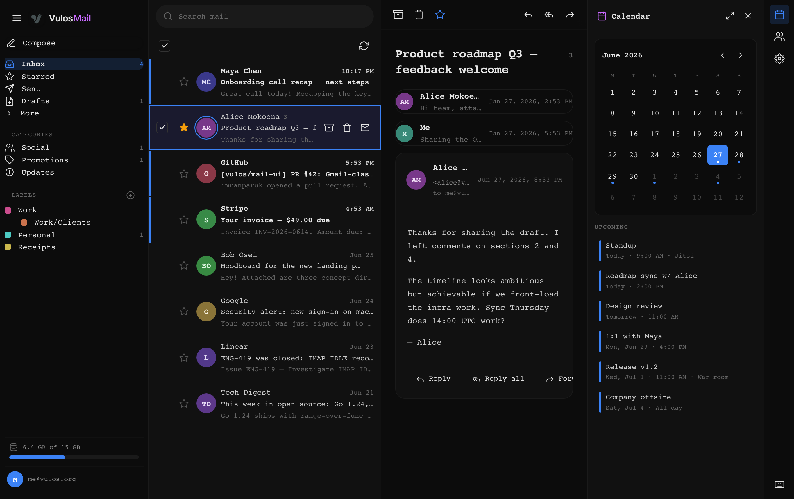
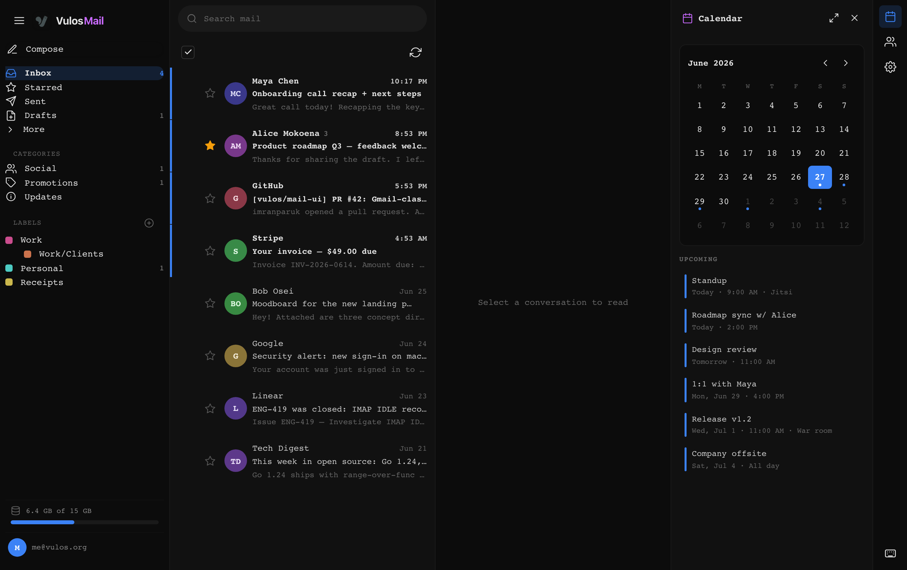
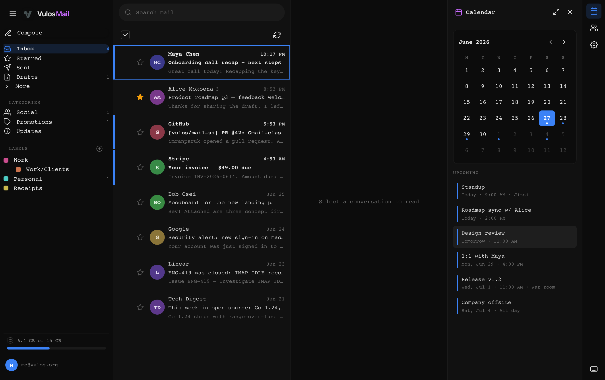
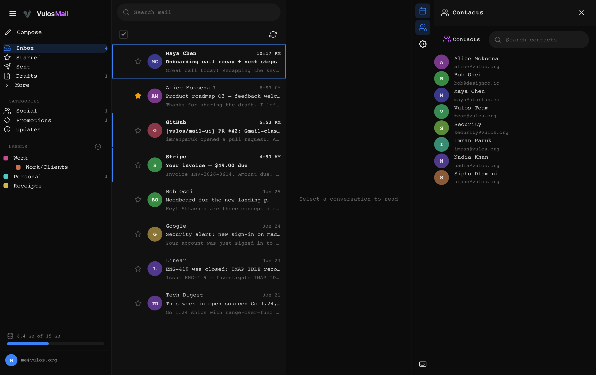
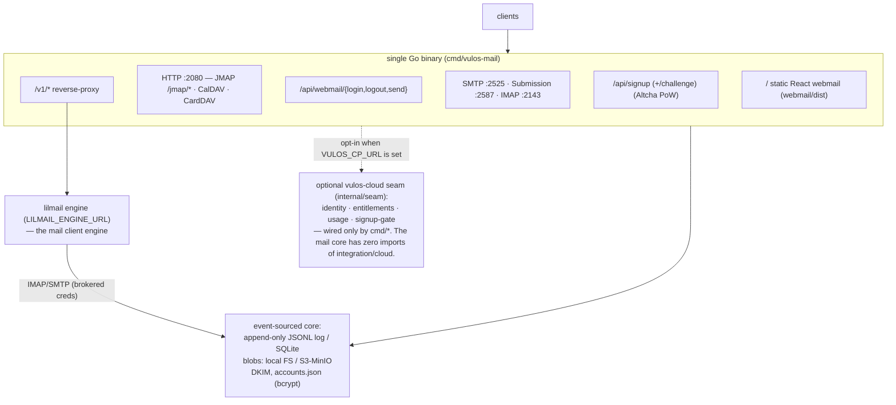

<div align="center">


# Vulos Mail

### Sovereign mail. You own it.

[](LICENSE)


<sub>Part of <strong><a href="https://vulos.org">VulOS</a></strong> — the open, self-hostable web OS &amp; app suite. Runs standalone, or combined under one login by <a href="https://vulos.org">Vulos Workspace</a>.</sub>

<br>



</div>

---

## What is Vulos Mail?

Vulos Mail is a complete, self-hostable **mail server** — SMTP · IMAP · JMAP ·
CalDAV · CardDAV — in a single static Go binary, with a modern **React webmail**
front end. It speaks the open protocols mail clients already use, ships a fast
keyboard-driven webmail, and stores everything in an append-only event log on
disk. No database server, no cloud, and no third-party API are required. Cloud
integration (billing, hosted identity) is **strictly optional** and lives behind
a small interface seam — the mail core never imports it.

## Part of VulOS

[VulOS](https://vulos.org) is an open, self-hostable web OS + app suite. Each
product is self-hostable on its own and can be combined under one login by
**Vulos Workspace**:

- **Vulos Mail** — mail + calendar + contacts (engine: lilmail; UI: `@vulos/mail-ui`; **server: vulos-mail**)
- **Vulos Talk** — team chat + channels/Spaces + huddles
- **Vulos Meet** — video meetings (LiveKit SFU)
- **Vulos Office** — documents: docs, sheets, slides, PDF
- **Vulos Relay** — sovereign connectivity fabric (`@vulos/relay-client`)
- **Vulos Workspace** — the open suite shell (one login, app switcher, admin)
- **Vulos OS** — the web-native desktop

**vulos-mail** is the **sovereign mail server** of the Vulos Mail product. The
React webmail it serves is the shared [`@vulos/mail-ui`](mail-ui/) library
(`<MailApp/>` / `<Calendar/>` / `<Contacts/>`); the standalone mail engine is
[lilmail](https://github.com/vul-os/lilmail). These couple only through clean
seams (the `/v1` HTTP contract and JMAP) — products never import one another's
code. vulos-mail runs standalone **and** is combined by Vulos Workspace.

## Features

**Server**
- **SMTP** inbound (MX) + authenticated **submission**, with an outbound queue
  and scheduler (retry/defer/bounce), DKIM signing, and optional rspamd scanning.
- **IMAP** and **JMAP** (RFC 8620/8621) access to the same mailbox.
- **CalDAV** + **CardDAV** for calendars and contacts.
- **Event-sourced** storage: append-only JSONL event log (or durable SQLite),
  blobs on local FS or S3/MinIO.
- **Self-serve signup** gated by a self-hosted **Altcha proof-of-work** challenge
  (no captcha service, no tracking).
- TLS via bring-your-own certs or built-in **ACME / Let's Encrypt**.
- Prometheus metrics endpoint.

**Webmail** (`webmail/` — a thin consumer of [`@vulos/mail-ui`](mail-ui/))
- Mounts the shared React `<MailApp/>` (folders | list | reading pane), with a
  responsive three-pane → single-pane phone layout.
- Compose / reply with rich body and recipient fields; outbound mail is sent
  through the lilmail engine (`POST /v1/messages` → SMTP submission).
- Search, mark read/unread, star, delete; OSS-native **Auto / dark / light**
  design tokens (mono-led, themeable accent, Vulos-purple brand).
- **Account & settings** for the self-hoster: identity, **IMAP/SMTP client
  setup** to wire up Thunderbird/Apple Mail/K-9, **change password**, and sign
  out — backed by `/api/webmail/account` (degrades to only what the server
  supports; change-password is hidden under the cloud control plane).
- Self-serve **signup** that solves the Altcha PoW in-browser and signs you in.
- **XSS-inert email rendering** — HTML bodies are sanitized (DOMPurify) to an
  inert safe subset; scripts / `onerror` / `javascript:` never survive.

## Screenshots

The webmail mounts `@vulos/mail-ui`; its gallery is captured against a seeded
**mock `/v1`** (no live backend). Regenerate from the `@vulos/mail-ui` repo with
`npm run screenshots`, then copy the gallery into `docs/screenshots/`.

| Mail | Calendar | Contacts |
|------|----------|----------|
| [](docs/screenshots/mail.png) | [](docs/screenshots/calendar.png) | [](docs/screenshots/contacts.png) |

## Quick start (standalone)

The **mail server** (SMTP/IMAP/JMAP/CalDAV/CardDAV) runs entirely by itself — a
domain, a data directory, and (optionally) a seed account are the whole
dependency list. The **bundled webmail** additionally needs a lilmail engine to
serve its `/v1` data (see [How it works](#how-it-works)); point at it with
`LILMAIL_ENGINE_URL`.

```sh
# 1. build the React webmail → webmail/dist
cd webmail && npm ci && npm run build && cd ..

# 2. build + run the server (serves webmail/dist at :2080 by default)
go build -o vulos-mail ./cmd/vulos-mail

VULOS_DOMAIN=example.com \
VULOS_DATA_DIR=/var/lib/vulos-mail \
VULOS_ACCOUNT=you@example.com VULOS_PASSWORD=change-me \
LILMAIL_ENGINE_URL=http://localhost:8080 LILMAIL_BROKER_SECRET=shared-secret \
./vulos-mail
```

Open <http://localhost:2080> and sign in. (Without `LILMAIL_ENGINE_URL`, sign-in
still works but the mail surface shows "mail engine not configured"; IMAP/JMAP
clients are unaffected.)

### Docker

```sh
docker build -t vulos-mail .      # multi-stage: builds webmail + Go binary
docker run -p 2080:2080 -p 2525:2525 -p 2587:2587 -p 2143:2143 \
  -e VULOS_DOMAIN=example.com -e VULOS_ACCOUNT=you@example.com \
  -e VULOS_PASSWORD=change-me -v vulos-data:/data vulos-mail
```

## How it works



The webmail is a static SPA that mounts the shared `@vulos/mail-ui`
`<MailApp/>`, which talks **only** to the lilmail `/v1` JSON API for all mail
data (identity, folders, messages, search, flags, delete, and send). vulos-mail
is the **server**; lilmail is the **client engine**. The standalone webmail
deployment is therefore *vulos-mail (server) + a lilmail engine + `@vulos/mail-ui`*:

- The webmail signs in via `POST /api/webmail/login`, which validates the mailbox
  credentials and mints an **HttpOnly session cookie** (the password is held
  server-side, never in the browser).
- vulos-mail reverse-proxies `/v1/*` to the lilmail engine at `LILMAIL_ENGINE_URL`,
  injecting the signed-in user's credentials as lilmail **broker headers**
  (`X-Vulos-Mail-*`, gated by the shared `LILMAIL_BROKER_SECRET`). lilmail then
  connects back to vulos-mail's IMAP/SMTP with those credentials to serve the
  request — including outbound mail (`POST /v1/messages` → SMTP submission).
- When `LILMAIL_ENGINE_URL` is **unset**, `/v1` returns a clear
  `{"error":"mail engine not configured"}` (503) instead of a confusing 404, and
  the webmail surfaces a "mail engine not configured" state. JMAP, IMAP, CalDAV,
  CardDAV and the `/api/webmail/send` API still work for non-webmail clients.

## Configuration

All configuration is via environment variables. Common ones:

| Env | Default | Purpose |
|---|---|---|
| `VULOS_DOMAIN` | `vulos.to` | the mail domain |
| `VULOS_DATA_DIR` | `./data` | data root (event log, blobs, accounts, DKIM) |
| `VULOS_ACCOUNT` / `VULOS_PASSWORD` | — | provision one seed account at startup |
| `VULOS_WEBMAIL_DIR` | `./webmail/dist` | static webmail directory to serve |
| `LILMAIL_ENGINE_URL` | — | lilmail engine the webmail's `/v1` is proxied to (required for the bundled webmail to read/send mail) |
| `LILMAIL_BROKER_SECRET` | — | shared secret sent to the engine to authorize brokered per-request credentials (must match lilmail's `LILMAIL_BROKER_SECRET`) |
| `VULOS_MAIL_IMAP_HOST` / `VULOS_MAIL_IMAP_PORT` | `VULOS_DOMAIN` / `993` | IMAP endpoint advertised to the engine (implicit-TLS) |
| `VULOS_MAIL_SMTP_HOST` / `VULOS_MAIL_SMTP_PORT` | `VULOS_DOMAIN` / `587` | SMTP submission endpoint advertised to the engine |
| `VULOS_MX_ADDR` | `:2525` | inbound SMTP listen address |
| `VULOS_SUBMIT_ADDR` | `:2587` | authenticated submission address |
| `VULOS_IMAP_ADDR` | `:2143` | IMAP listen address |
| `VULOS_JMAP_ADDR` | `:2080` | HTTP (JMAP / DAV / API / webmail) address |
| `VULOS_METRICS_ADDR` | `:2090` | Prometheus metrics address |
| `VULOS_TLS_CERT` / `VULOS_TLS_KEY` | — | bring-your-own TLS |
| `VULOS_ACME_DOMAINS` | — | Let's Encrypt via ACME (HTTP-01 on :80) |
| `VULOS_DB` | JSONL | set `sqlite` for a durable SQLite event log |
| `VULOS_S3_ENDPOINT` | — | store blobs in S3 / MinIO instead of local FS |
| `VULOS_SIGNUP` | on | set `off` to disable public self-serve signup |
| `VULOS_ALTCHA_SECRET` | random | stable signing key for signup PoW challenges |
| `VULOS_CP_URL` / `VULOS_CP_SECRET` | — | opt into the vulos-cloud control-plane seam |

See [`SELFHOST.md`](SELFHOST.md) for the full list and the integration-seam details.

## Documentation

| Doc | What |
|---|---|
| [`SELFHOST.md`](SELFHOST.md) | Full self-hosting guide + integration-seam details |
| [`mail-ui/README.md`](mail-ui/README.md) | The shared `@vulos/mail-ui` React component library |
| [`mail-ui/docs/SCREENSHOTS.md`](mail-ui/docs/SCREENSHOTS.md) | How the webmail screenshots are generated |
| [`docs/DESIGN.md`](docs/DESIGN.md) | Design system + UX notes |
| [`docs/BILLING-MODEL.md`](docs/BILLING-MODEL.md) | Optional hosted/billing seam model |

## Development

```sh
# Server
go build ./...                # build everything
go test ./...                 # Go unit + integration tests

# Shared mail UI (@vulos/mail-ui)
cd mail-ui
npm install
npm run build                 # demo SPA → dist/
npm run build:lib             # redistributable library → dist-lib/
npm test                      # Vitest
npm run screenshots           # regenerate docs/screenshots (mock /v1)

# Webmail (thin consumer)
cd webmail
npm install
npm run dev                   # Vite dev server with HMR (proxies /v1 + /api + /jmap + /dav
                              #   to a running vulos-mail; override with VULOS_DEV_BACKEND)
npm run build                 # production build → webmail/dist

# End-to-end
./test/webmail/run.sh         # build webmail, boot server, seed mail, drive SPA
```

The end-to-end harness builds the webmail, points `VULOS_WEBMAIL_DIR` at
`webmail/dist`, seeds an inbox (including a hostile XSS-probe message), and
asserts behavior across login, signup PoW, list, read, XSS-inertness, star,
search, compose, contacts, calendar, and settings.

## Contributing

Issues and pull requests are welcome. Keep the build, tests, and lint green, and
preserve the clean product seams (no cross-product imports). See
[`SELFHOST.md`](SELFHOST.md) and [`mail-ui/README.md`](mail-ui/README.md).

## License

[MIT](LICENSE) © Imran Paruk and Vulos Contributors. Part of VulOS; the mail core
is independent and self-hostable with no external service dependencies.
