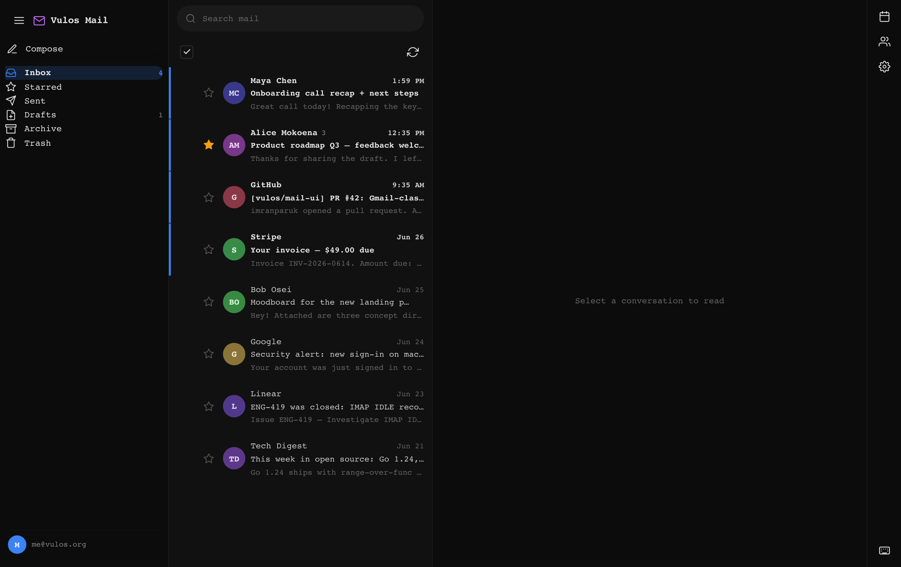
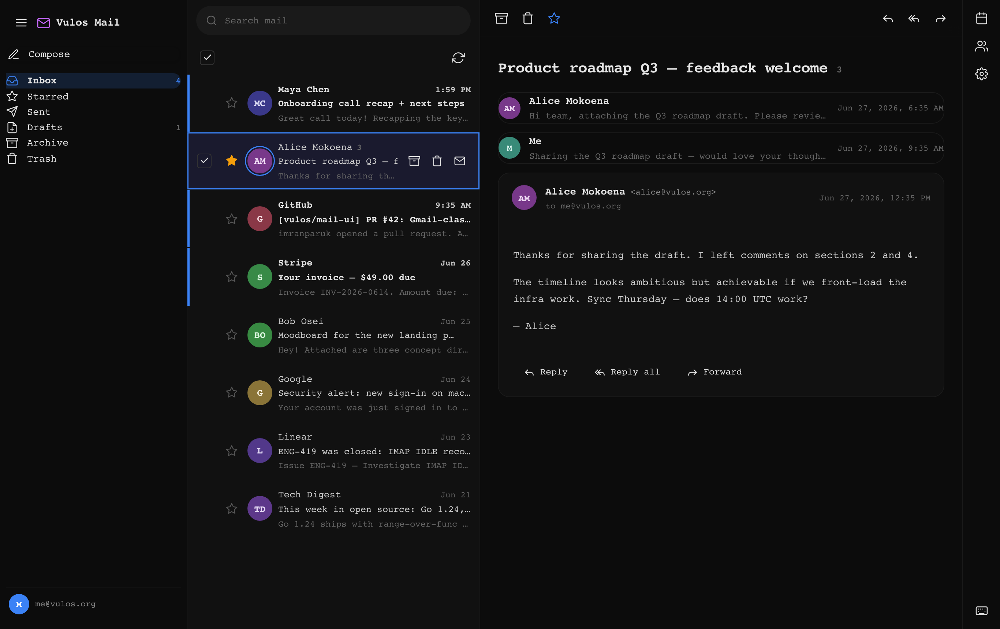
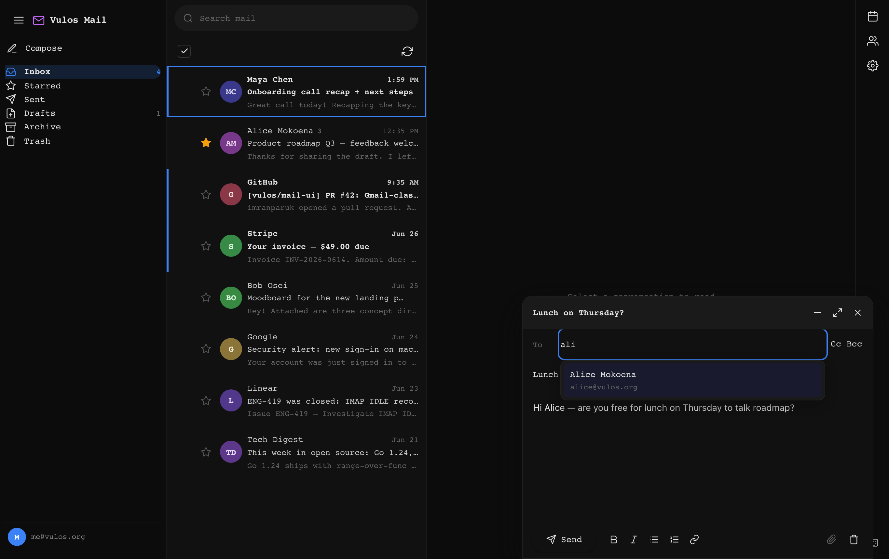
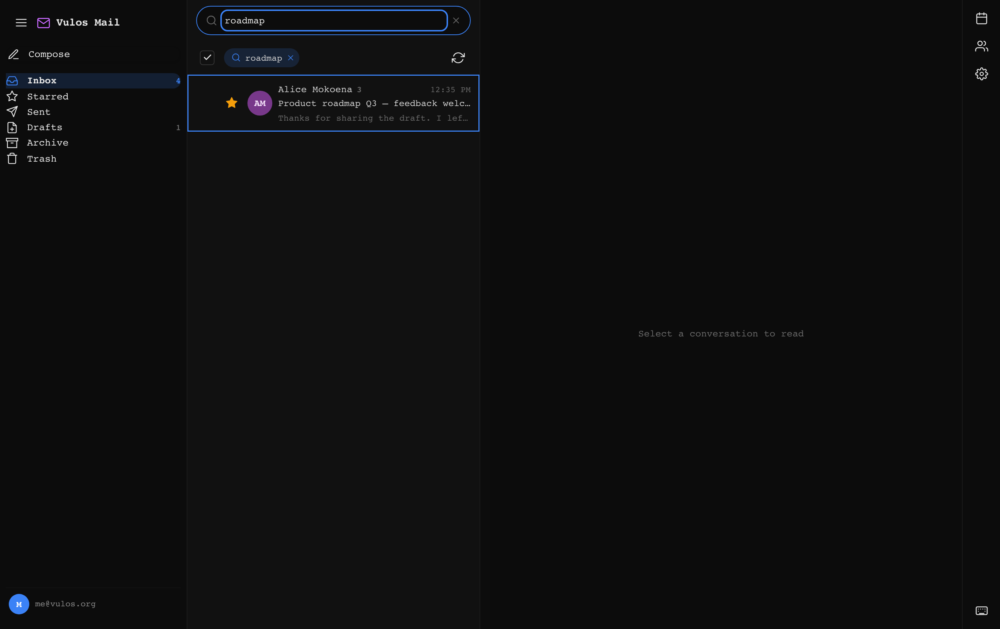
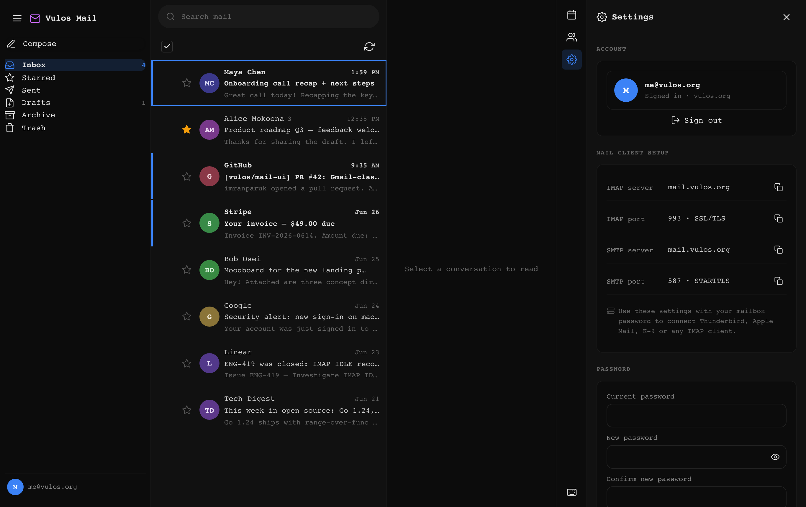
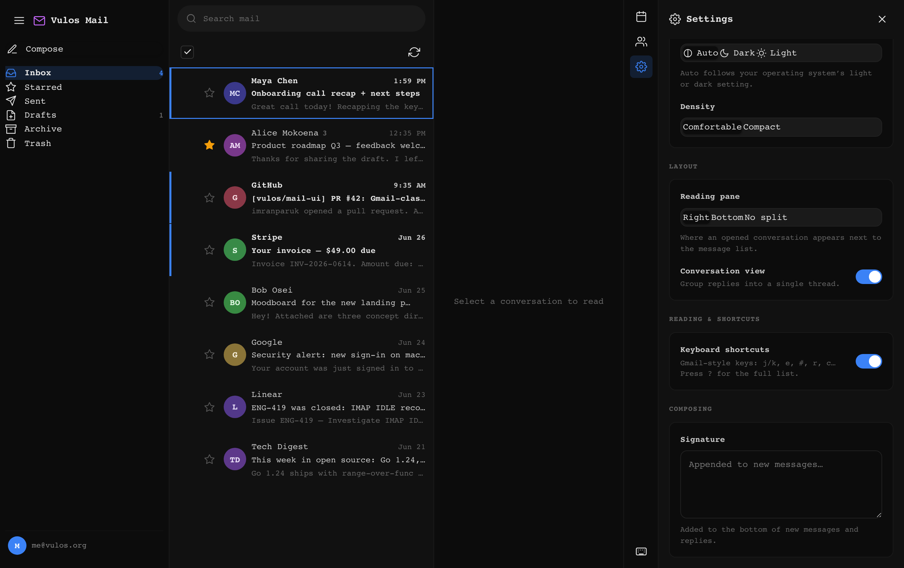
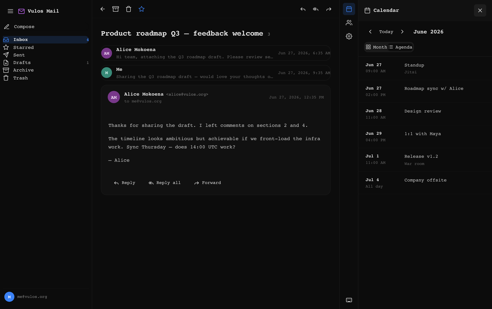
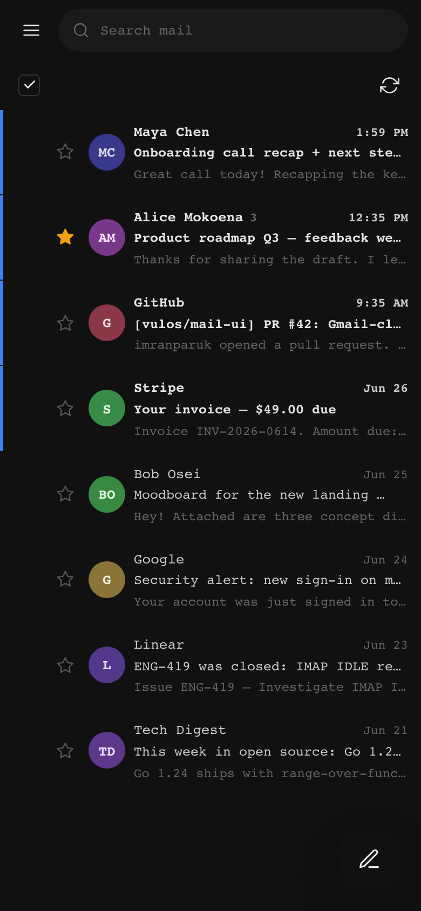
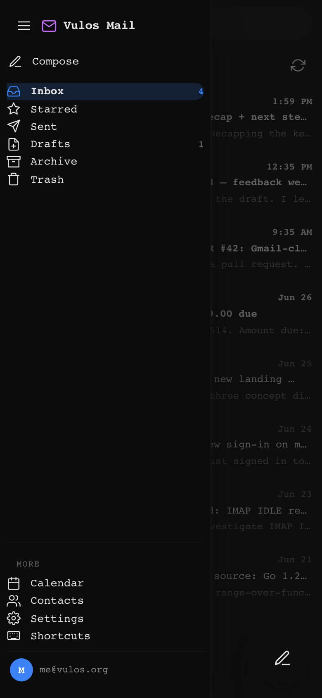

# @vulos/mail-ui

<sub>Part of <strong><a href="https://vulos.org">VulOS</a></strong> — the open, self-hostable web OS &amp; app suite. Runs standalone, or combined under one login by <a href="https://vulos.org">Vulos Workspace</a>.</sub>

Shared React webmail UI for the Vulos suite. It is a thin, reusable component
library that renders a full three-pane webmail experience and talks to
**lilmail's `/v1` JSON API** (see `lilmail/docs/API.md`). The only coupling to a
backend is that HTTP contract — there is no direct dependency on lilmail or any
other Vulos repo.

Both `vulos-mail/webmail` and the Vulos Workspace shell mount this package so
there is exactly one mail UI to maintain.

## Part of VulOS

[VulOS](https://vulos.org) is an open, self-hostable web OS + app suite. Each
product is self-hostable on its own and can be combined under one login by
**Vulos Workspace**:

- **Vulos Mail** — mail + calendar + contacts (engine: lilmail; **UI: `@vulos/mail-ui`**; server: vulos-mail)
- **Vulos Talk** — team chat + channels/Spaces + huddles
- **Vulos Meet** — video meetings (LiveKit SFU)
- **Vulos Office** — documents: docs, sheets, slides, PDF
- **Vulos Relay** — sovereign connectivity fabric (`@vulos/relay-client`)
- **Vulos Workspace** — the open suite shell (one login, app switcher, admin)
- **Vulos OS** — the web-native desktop

`@vulos/mail-ui` is the **React UI of the Vulos Mail product** — the `<MailApp/>`,
`<Calendar/>`, and `<Contacts/>` surface. It renders against the `/v1` HTTP
contract only, so it runs standalone (against lilmail or any `/v1` server) **and**
is combined by Vulos Workspace. Products never import one another's code.

## A Gmail-class webmail, in the Vulos aesthetic

`@vulos/mail-ui` renders a full, polished webmail with Gmail's information
density and interaction model, drawn in the OSS-native near-black / mono-led
Vulos theme:

- **Three-pane** layout with a collapsible left rail (special folders first —
  Inbox / Starred / Sent / Drafts / Archive / Trash with unread counts and
  icons, then labels), a **reading-pane position** toggle (right / bottom / off)
  and a comfortable / compact **density** toggle — both persisted to
  `localStorage`.
- **Theme** — Auto (follows the OS light/dark setting live), Dark or Light;
  applied via tokenised CSS custom properties, AA-contrast in both modes.
- **Conversation threading** — messages are grouped client-side by
  `References` / `In-Reply-To` / `Message-ID`; thread rows show a count and the
  reading pane renders a collapsible conversation (latest expanded).
- **Message list** with colour-hashed avatars, snippet preview, relative dates,
  attachment indicator, **star**, unread accent rail, per-row **hover
  quick-actions** (archive / delete / mark read), **multi-select** with a
  **bulk action bar**, and "select all".
- **Docked compose** (bottom-right) with minimise / full-screen, To/Cc/Bcc
  **contact autocomplete**, a rich-text toolbar (bold / italic / lists / link →
  HTML, plain-text fallback), debounced **draft auto-save**, and
  reply / reply-all / forward prefill. Attachment upload is shown but disabled
  until `/v1` exposes it.
- **Keyboard shortcuts** (`j k o u e # r a f c s x / ?`) with a `?` help overlay
  (toggleable in Settings).
- **Search** with a results view and an active-query chip.
- **Optimistic** star (`\Flagged`), read/unread (`\Seen`), delete (to Trash) and
  archive (IMAP `MOVE`) — UI updates immediately and reverts on error.
- **Calendar + Contacts** as exported components, also embedded as a right-side
  panel; plus a sectioned **Settings** panel and skeleton / empty / error /
  toast states. A host can inject server-backed sections (account, change
  password, mail-client setup…) at the top of Settings via `settingsExtra`.
- **Motion** — side panels glide in, the compose dock rises, conversations and
  expanded messages fade up; all suppressed under `prefers-reduced-motion`.

Fully responsive: three-pane on desktop, side panels collapse ≤1024px, a
single-pane list ↔ message flow with a drawer rail and full-screen compose
≤768px (no horizontal scroll at 360px, ≥44px tap targets).

## Screenshots

Generated by the Playwright screenshotter against the seeded **mock `/v1`** demo
(no backend). Regenerate with `npm run screenshots`.

| Inbox (three-pane) | Conversation | Compose |
|------|------|------|
| [](docs/screenshots/inbox.png) | [](docs/screenshots/thread.png) | [](docs/screenshots/compose.png) |

| Search | Calendar | Contacts |
|------|------|------|
| [](docs/screenshots/search.png) | [](docs/screenshots/calendar.png) | [](docs/screenshots/contacts.png) |

| Account | Settings |
|------|------|
| [](docs/screenshots/account.png) | [](docs/screenshots/settings.png) |

| Side panel + conversation | |
|------|------|
| [](docs/screenshots/panel-thread.png) | |

| Mobile | Mobile drawer |
|------|------|
| [](docs/screenshots/mobile.png) | [](docs/screenshots/mobile-drawer.png) |

## Install

```jsonc
// package.json
"dependencies": {
  "@vulos/mail-ui": "file:../mail-ui"
}
```

## Use

```jsx
import { MailApp } from '@vulos/mail-ui'
import '@vulos/mail-ui/style.css'   // tokens + component styles

export default function App() {
  return <MailApp baseUrl="/v1" onSend={async (draft) => { /* host send */ }} />
}
```

### Configuring the API base URL

`MailApp` (and the `api` client) default to the **same-origin** `/v1`. Point it
elsewhere with `baseUrl`, or pass a pre-built client:

```jsx
import { MailApp, createMailClient } from '@vulos/mail-ui'

const client = createMailClient({ baseUrl: 'https://mail.example.com/v1' })
<MailApp client={client} onAuthError={() => location.assign('/login')} />
```

All requests are sent with `credentials: 'include'` so the lilmail session
cookie rides along. A `401` surfaces as an `ApiError` with `.status === 401`
(and fires `onAuthError`).

### Injecting an account / settings surface

`MailApp` keeps the `/v1` mail contract pure, so anything server-specific
(account, change password, mail-client setup, sign out) is supplied by the host
through `settingsExtra` and rendered at the top of the Settings panel. The
bundled `vulos-mail/webmail` passes its `<AccountSettings/>` (backed by
`/api/webmail/account`), surfaced as styled sections using the shared tokens:

```jsx
<MailApp baseUrl="/v1" settingsExtra={<AccountSettings onLogout={signOut} />} />
```

## Exports

| Export | What |
|---|---|
| `MailApp` | Full three-pane app (folders \| list \| reading pane), responsive, wired to `/v1`. Sends via `POST /v1/messages` by default; override with `onSend`. |
| `Calendar` | Month + agenda views over `GET /v1/calendar/events` (requires lilmail `[caldav]`). |
| `Contacts` | Searchable contact list over `GET /v1/contacts` (requires lilmail `[carddav]`). |
| `FolderList`, `MessageList`, `MessageView`, `Compose`, `Settings`, `Icon` | Individual components. |
| `groupThreads`, `useSettings`, `DEFAULT_SETTINGS` | Threading grouping + persisted-settings helpers. |
| `createMailClient`, `ApiError`, `FLAG_SEEN`, `FLAG_FLAGGED` | `/v1` API client (mail + calendar + contacts + `moveMessage`). |
| `sanitizeEmailHtml`, `stripHtml` | DOMPurify-based HTML sanitisers for email bodies. |
| `@vulos/mail-ui/api` | The api client module on its own. |
| `@vulos/mail-ui/style.css` | Stylesheet (OSS-native design tokens + components). |

```jsx
import { Calendar, Contacts } from '@vulos/mail-ui'

<Calendar baseUrl="/v1" onAuthError={() => location.assign('/login')} />
<Contacts baseUrl="/v1" onSelect={(c) => startCompose(c.email)} />
```

## Design

OSS-native visual identity (per `vulos-cloud/DESIGN_OSS_NATIVE.md`): near-black
canvas, mono-led type, themeable `--accent`, reserved `--brand`. All colours come
from CSS custom properties in `src/tokens.css` — no hardcoded hex in components.
Light theme via `[data-theme="light"]` on a host element. Email HTML is always
sanitised before render.

## Scripts

```bash
npm run dev        # standalone demo (in-memory mock client)
npm run build      # demo SPA → dist/
npm run build:lib  # redistributable library → dist-lib/ (+ mail-ui.css)
npm test           # vitest
```

## Status / graceful degradation

`<Compose/>` sends through `POST /v1/messages` by default (via `client.sendMessage`).
A host may override `onSend` to route outbound mail through its own transport.
The bundled `vulos-mail/webmail` uses the default — its `/v1` is reverse-proxied
to a lilmail engine that submits over SMTP.

- **Archive / move** uses `POST /v1/messages/:uid/move` (lilmail's IMAP
  `MOVE`/`COPY`+expunge). If the server has no Archive folder or the endpoint is
  absent (older lilmail), the archive affordances are **hidden** automatically.
- **Delete** moves to Trash via `DELETE /v1/messages/:uid` (lilmail soft-deletes
  to Trash by default; `?hard=true` expunges).
- **Attachment upload** is not yet exposed over `/v1`, so the compose attach
  control is shown **disabled** with a tooltip; we never fake sending. Download
  of received attachments over `/v1` is likewise pending — attachments render as
  non-interactive chips. Track both in lilmail's `ROADMAP.md`.
