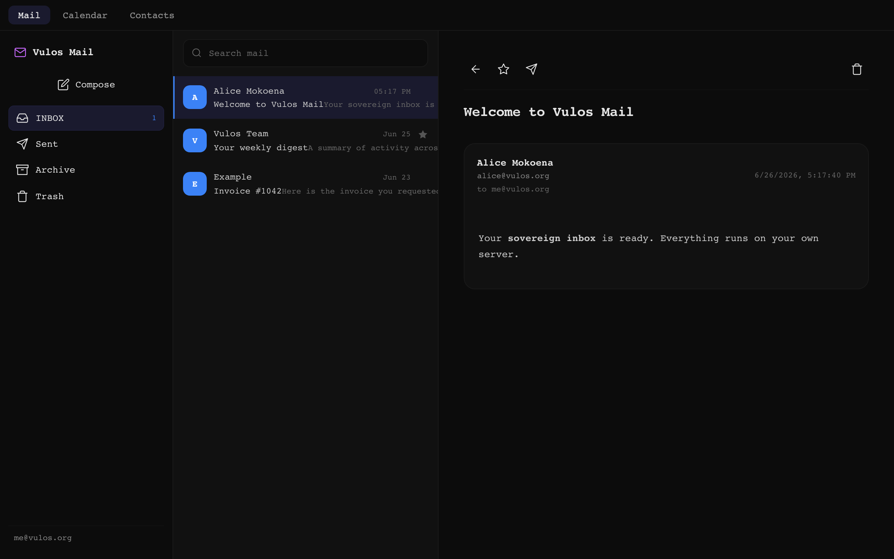
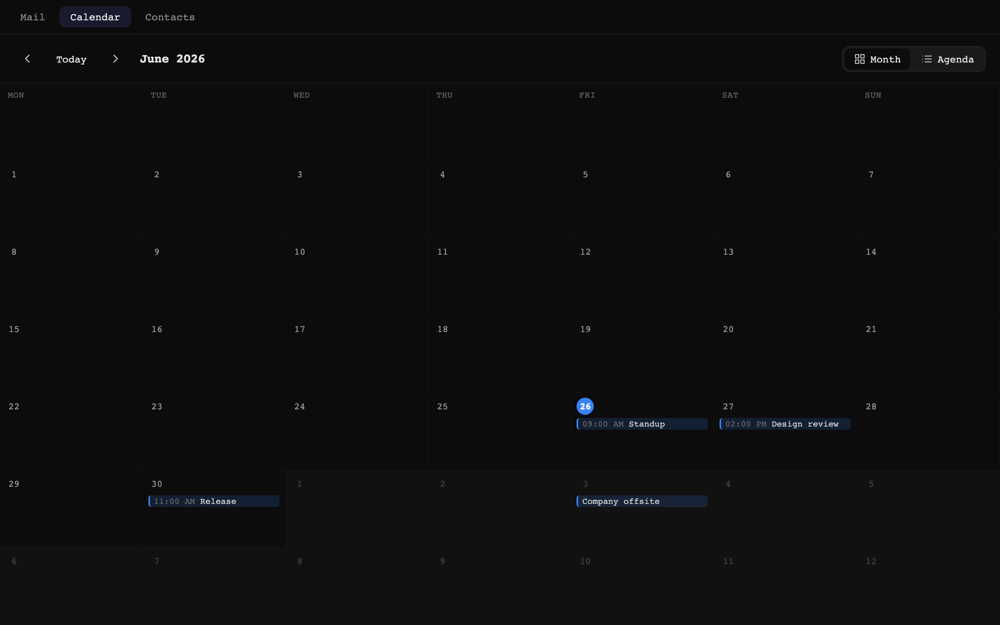
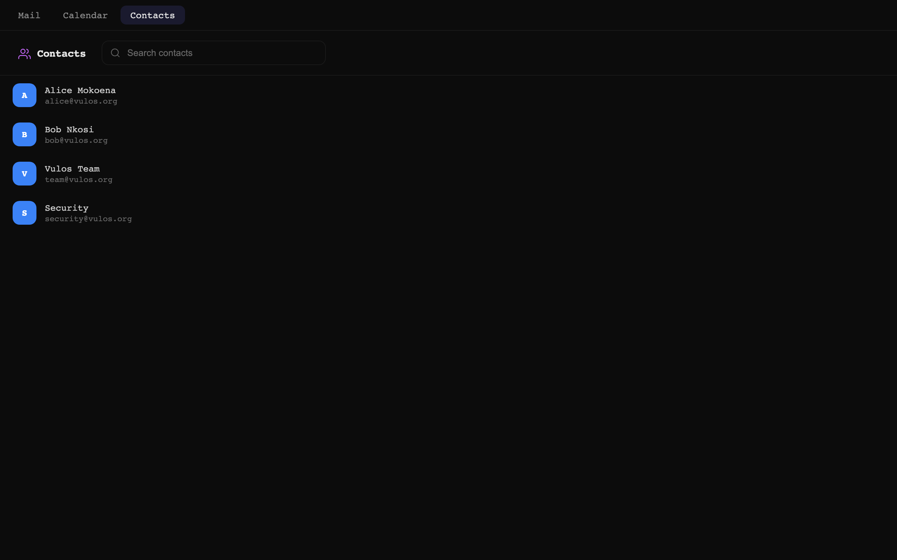

# @vulos/mail-ui

<sub>Part of <strong><a href="https://vulos.org">VulOS</a></strong> — the open, self-hostable web OS &amp; app suite. Runs standalone, or combined under one login by <a href="https://vulos.org">Vulos Workspace</a>.</sub>

Shared React webmail UI for the Vulos suite. It is a thin, reusable component
library that renders a full three-pane webmail experience and talks to
**lilmail's `/v1` JSON API** (see `lilmail/docs/API.md`). The only coupling to a
backend is that HTTP contract — there is no direct dependency on lilmail or any
other Vulos repo.

Both `vulos-mail/webmail` and the Vulos Workspace shell mount this package so
there is exactly one mail UI to maintain.

## Part of VulOS

[VulOS](https://vulos.org) is an open, self-hostable web OS + app suite. Each
product is self-hostable on its own and can be combined under one login by
**Vulos Workspace**:

- **Vulos Mail** — mail + calendar + contacts (engine: lilmail; **UI: `@vulos/mail-ui`**; server: vulos-mail)
- **Vulos Talk** — team chat + channels/Spaces + huddles
- **Vulos Meet** — video meetings (LiveKit SFU)
- **Vulos Office** — documents: docs, sheets, slides, PDF
- **Vulos Relay** — sovereign connectivity fabric (`@vulos/relay-client`)
- **Vulos Workspace** — the open suite shell (one login, app switcher, admin)
- **Vulos OS** — the web-native desktop

`@vulos/mail-ui` is the **React UI of the Vulos Mail product** — the `<MailApp/>`,
`<Calendar/>`, and `<Contacts/>` surface. It renders against the `/v1` HTTP
contract only, so it runs standalone (against lilmail or any `/v1` server) **and**
is combined by Vulos Workspace. Products never import one another's code.

## Screenshots

Generated by the Playwright screenshotter against the seeded **mock `/v1`** demo
(no backend). Regenerate with `npm run screenshots`; see
[`docs/SCREENSHOTS.md`](docs/SCREENSHOTS.md).

| Mail | Calendar | Contacts |
|------|----------|----------|
| [](docs/screenshots/mail.png) | [](docs/screenshots/calendar.png) | [](docs/screenshots/contacts.png) |

## Install

```jsonc
// package.json
"dependencies": {
  "@vulos/mail-ui": "file:../mail-ui"
}
```

## Use

```jsx
import { MailApp } from '@vulos/mail-ui'
import '@vulos/mail-ui/style.css'   // tokens + component styles

export default function App() {
  return <MailApp baseUrl="/v1" onSend={async (draft) => { /* host send */ }} />
}
```

### Configuring the API base URL

`MailApp` (and the `api` client) default to the **same-origin** `/v1`. Point it
elsewhere with `baseUrl`, or pass a pre-built client:

```jsx
import { MailApp, createMailClient } from '@vulos/mail-ui'

const client = createMailClient({ baseUrl: 'https://mail.example.com/v1' })
<MailApp client={client} onAuthError={() => location.assign('/login')} />
```

All requests are sent with `credentials: 'include'` so the lilmail session
cookie rides along. A `401` surfaces as an `ApiError` with `.status === 401`
(and fires `onAuthError`).

## Exports

| Export | What |
|---|---|
| `MailApp` | Full three-pane app (folders \| list \| reading pane), responsive, wired to `/v1`. Sends via `POST /v1/messages` by default; override with `onSend`. |
| `Calendar` | Month + agenda views over `GET /v1/calendar/events` (requires lilmail `[caldav]`). |
| `Contacts` | Searchable contact list over `GET /v1/contacts` (requires lilmail `[carddav]`). |
| `FolderList`, `MessageList`, `MessageView`, `Compose`, `Icon` | Individual components. |
| `createMailClient`, `ApiError`, `FLAG_SEEN`, `FLAG_FLAGGED` | `/v1` API client (mail + calendar + contacts). |
| `sanitizeEmailHtml`, `stripHtml` | DOMPurify-based HTML sanitisers for email bodies. |
| `@vulos/mail-ui/api` | The api client module on its own. |
| `@vulos/mail-ui/style.css` | Stylesheet (OSS-native design tokens + components). |

```jsx
import { Calendar, Contacts } from '@vulos/mail-ui'

<Calendar baseUrl="/v1" onAuthError={() => location.assign('/login')} />
<Contacts baseUrl="/v1" onSelect={(c) => startCompose(c.email)} />
```

## Design

OSS-native visual identity (per `vulos-cloud/DESIGN_OSS_NATIVE.md`): near-black
canvas, mono-led type, themeable `--accent`, reserved `--brand`. All colours come
from CSS custom properties in `src/tokens.css` — no hardcoded hex in components.
Light theme via `[data-theme="light"]` on a host element. Email HTML is always
sanitised before render.

## Scripts

```bash
npm run dev        # standalone demo (in-memory mock client)
npm run build      # demo SPA → dist/
npm run build:lib  # redistributable library → dist-lib/ (+ mail-ui.css)
npm test           # vitest
```

## Status / gaps

`<Compose/>` sends through `POST /v1/messages` by default (via `client.sendMessage`).
A host may still override `onSend` to route outbound mail through its own
transport (e.g. `vulos-mail/webmail` submits over JMAP). Attachment upload over
`/v1` is not yet exposed by lilmail — see its `ROADMAP.md`.
